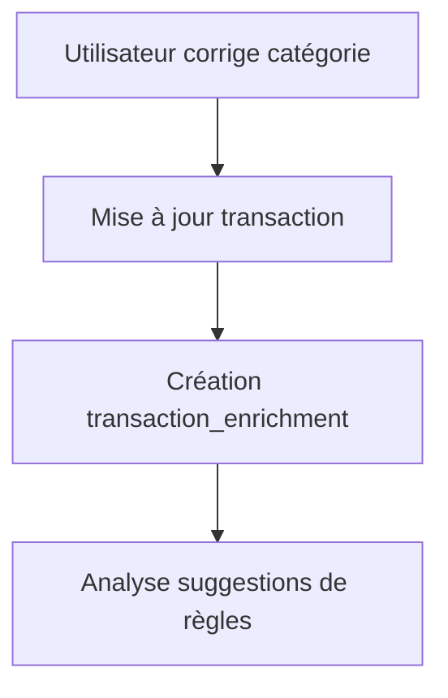

# Correction manuelle de catégorie

## Objectif

Permettre à l'utilisateur de corriger une transaction mal classée.

## Flux

## Règle produit

Une correction manuelle doit toujours être historisée.

## Suggestion de règle

Si plusieurs corrections similaires apparaissent sur un même motif de libellé, le système pourra proposer une règle.

En v7, la suggestion reste simple et consultable via API.
