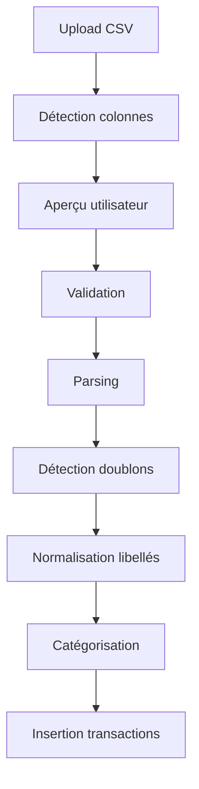

# Import CSV bancaire

## Objectif

Permettre à l'utilisateur d'importer ses transactions sans connecter immédiatement sa banque.

## Pourquoi commencer par le CSV ?

- Réduit les contraintes réglementaires initiales.
- Permet de tester la valeur produit rapidement.
- Évite une dépendance immédiate à un agrégateur Open Banking.
- Permet d'alimenter rapidement le moteur IA avec un historique réel.

## Flux cible

## Colonnes minimales

- date
- label
- amount
- currency

## Règles de validation

- Une date est obligatoire.
- Un libellé est obligatoire.
- Un montant est obligatoire.
- Une devise est recommandée, EUR par défaut.
- Les lignes invalides ne bloquent pas forcément tout l'import : elles sont retournées en erreur ligne par ligne.

## Statut v2

Le endpoint existe mais le parsing est simulé.
