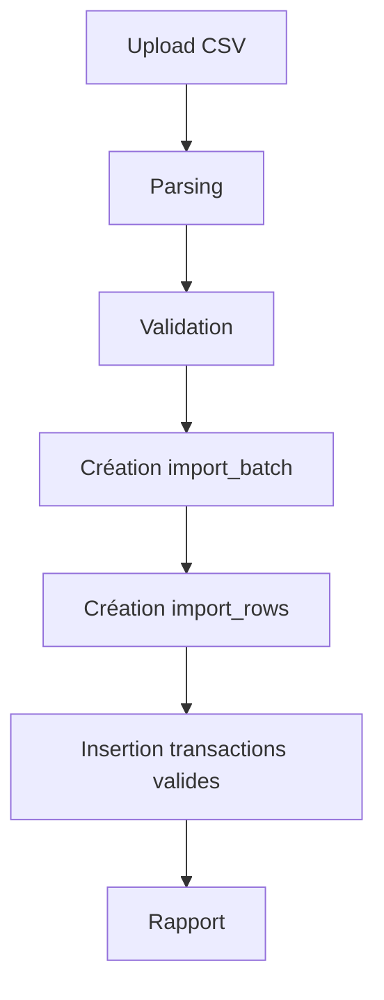

# Import CSV bancaire

## Format attendu

```csv
date,label,amount,currency
2026-06-25,CARREFOUR MARKET,-82.31,EUR
```

## Flux v4



## Détection doublons

Une empreinte `source_hash` est calculée à partir de :

- date ;
- libellé ;
- montant ;
- devise.

Si l'empreinte existe déjà, la transaction n'est pas réinsérée.
