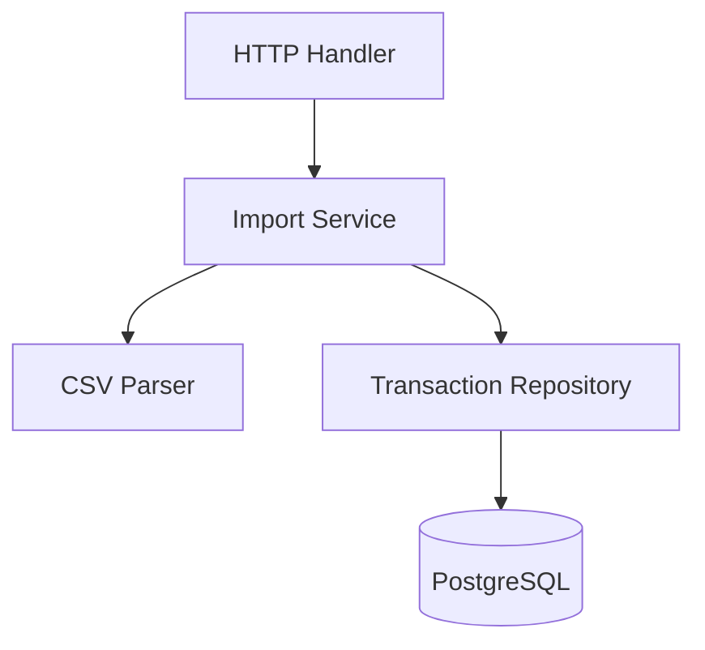

# Import CSV bancaire

## v5

Le flux d'import est maintenant découpé :

## Bénéfices

- Testabilité.
- Lisibilité.
- Préparation à plusieurs formats bancaires.
- Préparation aux règles de catégorisation.
