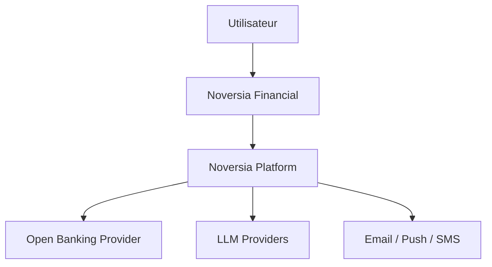
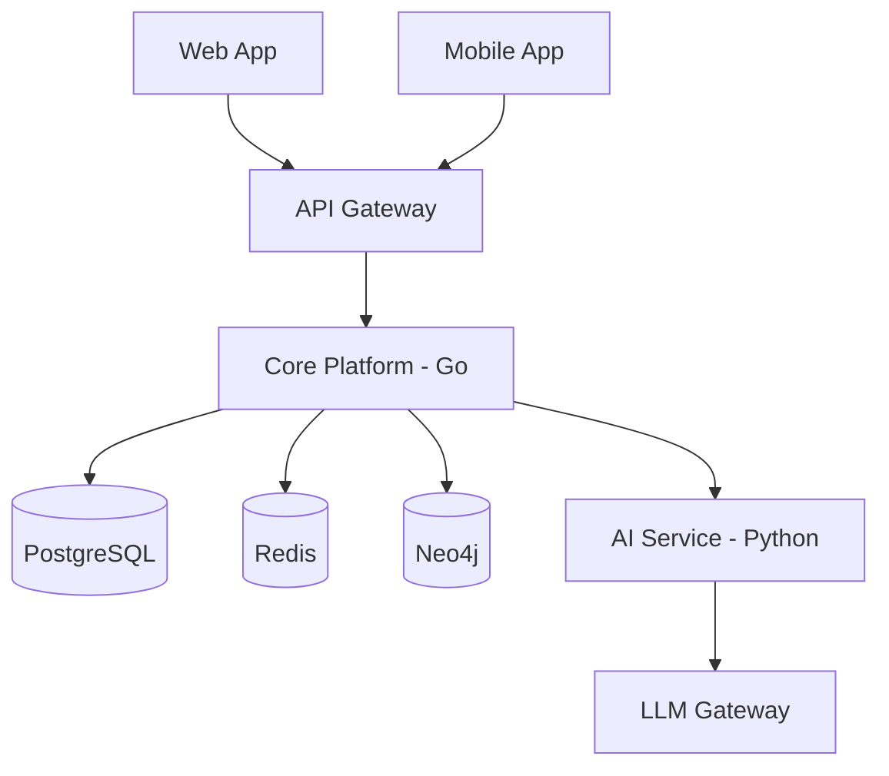

# Diagrammes C4

## Context

```mermaid
flowchart TD
    User[Utilisateur] --> App[Noversia Financial]
    App --> Platform[Noversia Platform]
    Platform --> Bank[Open Banking Provider]
    Platform --> LLM[LLM Providers]
    Platform --> Notify[Email / Push / SMS]
```

## Containers

```mermaid
flowchart TD
    Web[Web App] --> API[API Gateway]
    Mobile[Mobile App] --> API
    API --> Core[Core Platform - Go]
    Core --> PG[(PostgreSQL)]
    Core --> Redis[(Redis)]
    Core --> Graph[(Neo4j)]
    Core --> AI[AI Service - Python]
    AI --> LLM[LLM Gateway]
```
