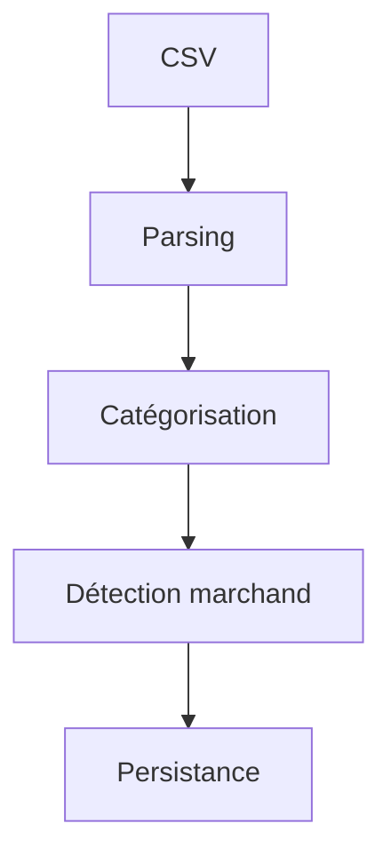

# Module Transactions

## v8

Nouveaux composants logiques :

- Détection marchand.
- Upsert marchand.
- Application de suggestion de règle.

## Flux import

```mermaid
flowchart TD
    A[CSV] --> B[Parsing]
    B --> C[Catégorisation]
    C --> D[Détection marchand]
    D --> E[Persistance]
```
