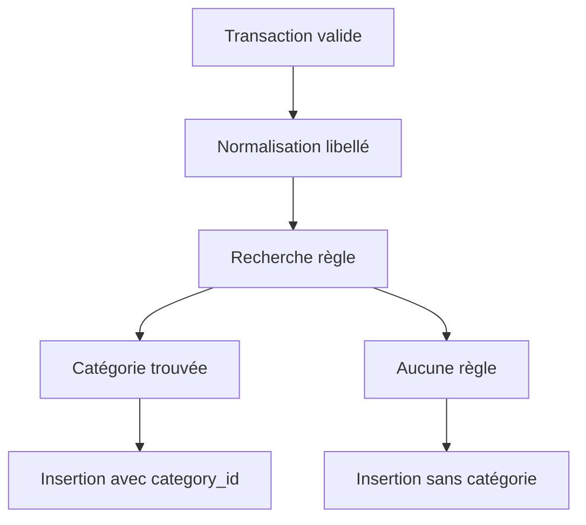

# Module Transactions

## v6

Nouveaux composants :

- `categorizer.go`
- `CategorizationRule`
- application des règles avant persistance

## Flux

```mermaid
flowchart TD
    A[Transaction valide] --> B[Normalisation libellé]
    B --> C[Recherche règle]
    C --> D[Catégorie trouvée]
    C --> E[Aucune règle]
    D --> F[Insertion avec category_id]
    E --> G[Insertion sans catégorie]
```
